# Mobile App Labs Submission

- Name: Abraham Alemtesfa Alefew
- ID: UGR/9689/16
---

## 1) Profile Card Lab

### Screenshot
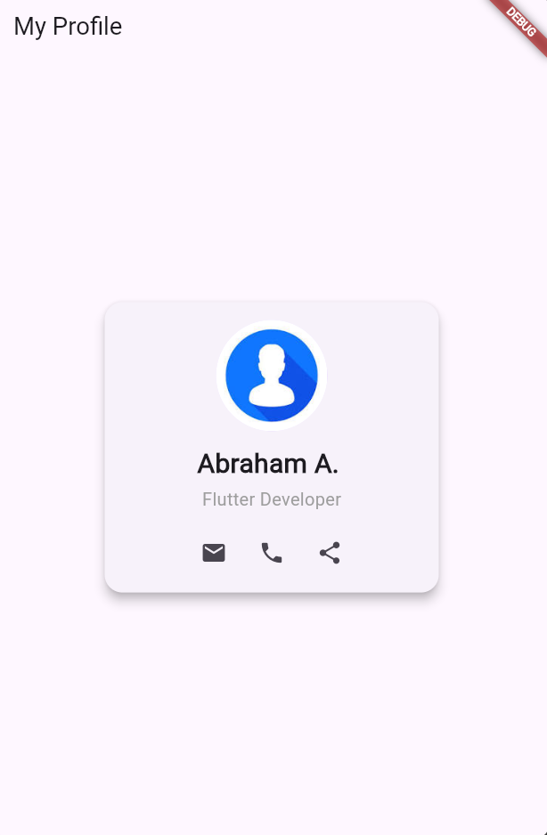

### Widget Tree
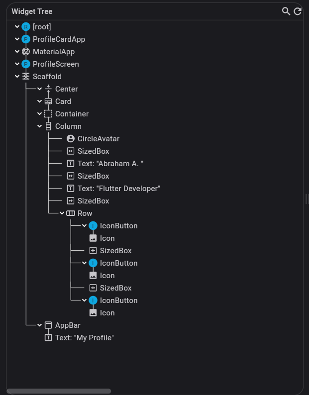

---

## 2) Bottom Navigation Lab

### Screenshots
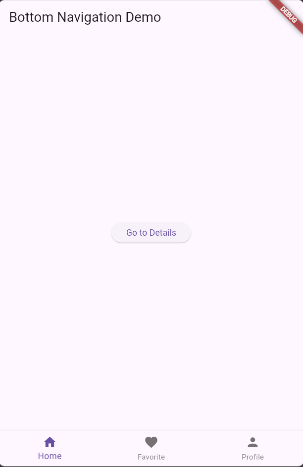
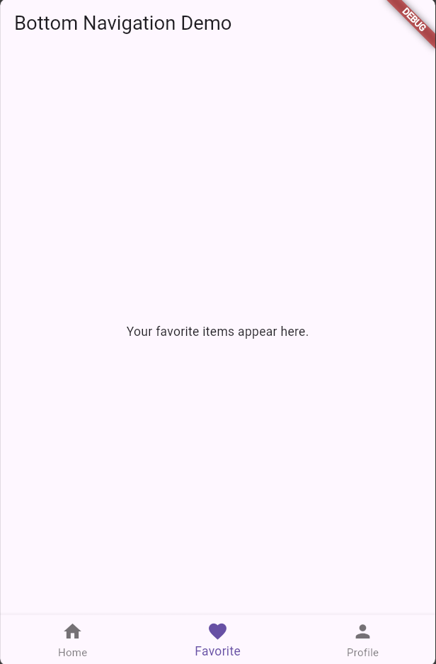
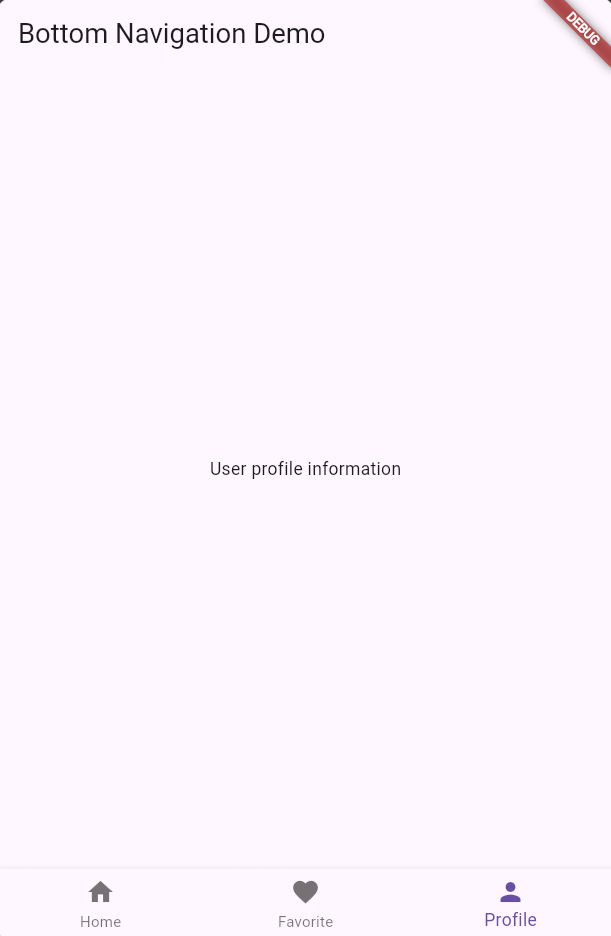
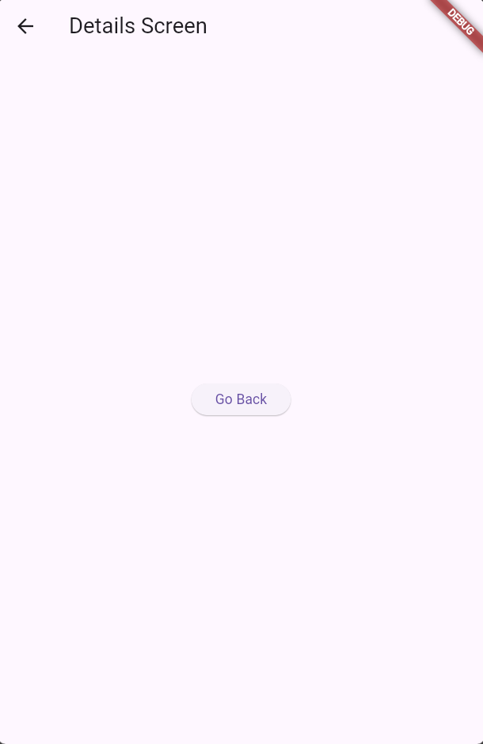

### Widget Tree
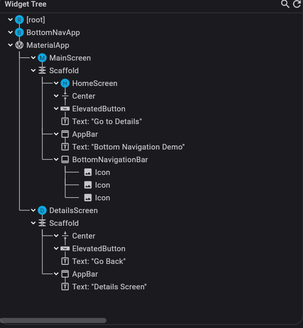

---

## 3) Product Catalog Lab

### Screenshot
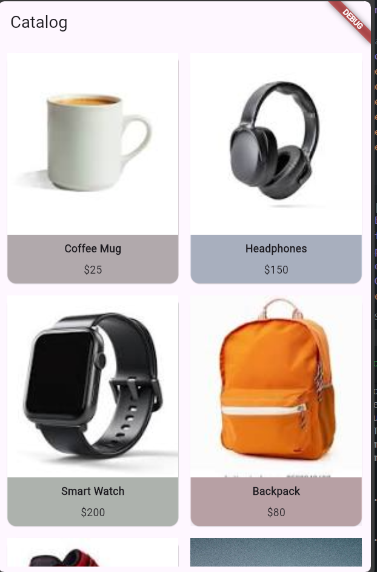

### Widget Tree
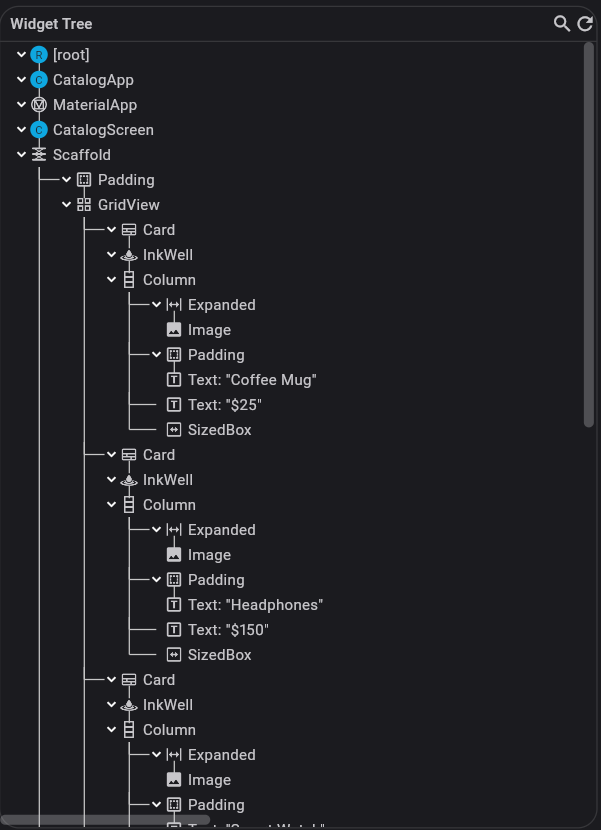

---

## 4) Registration Lab

### Screenshot
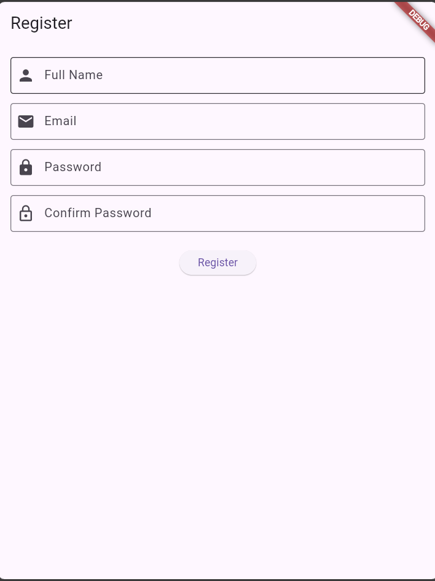

### Widget Tree
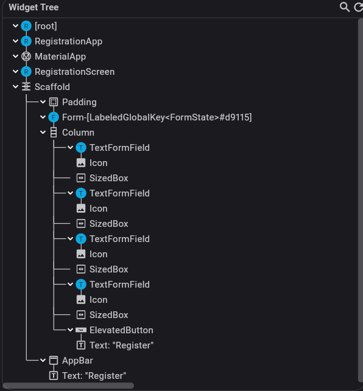

---

## 5) Go Routing Lab

### Screenshot
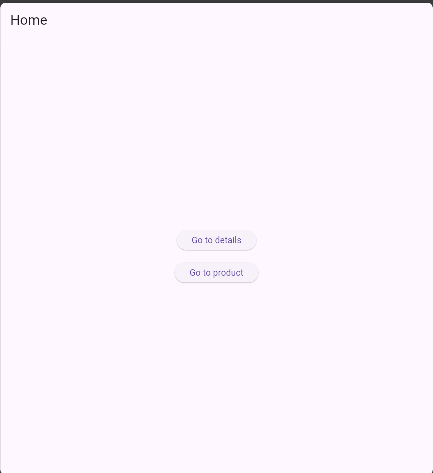
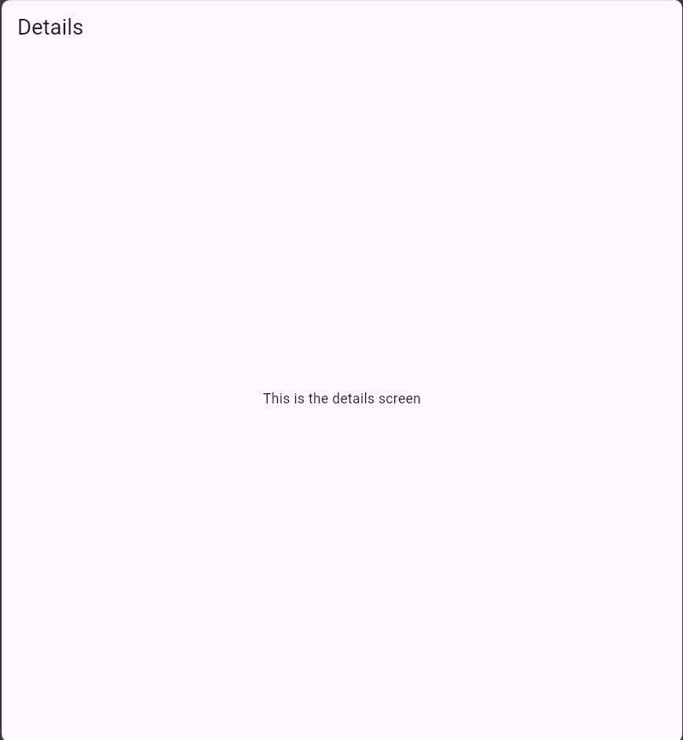
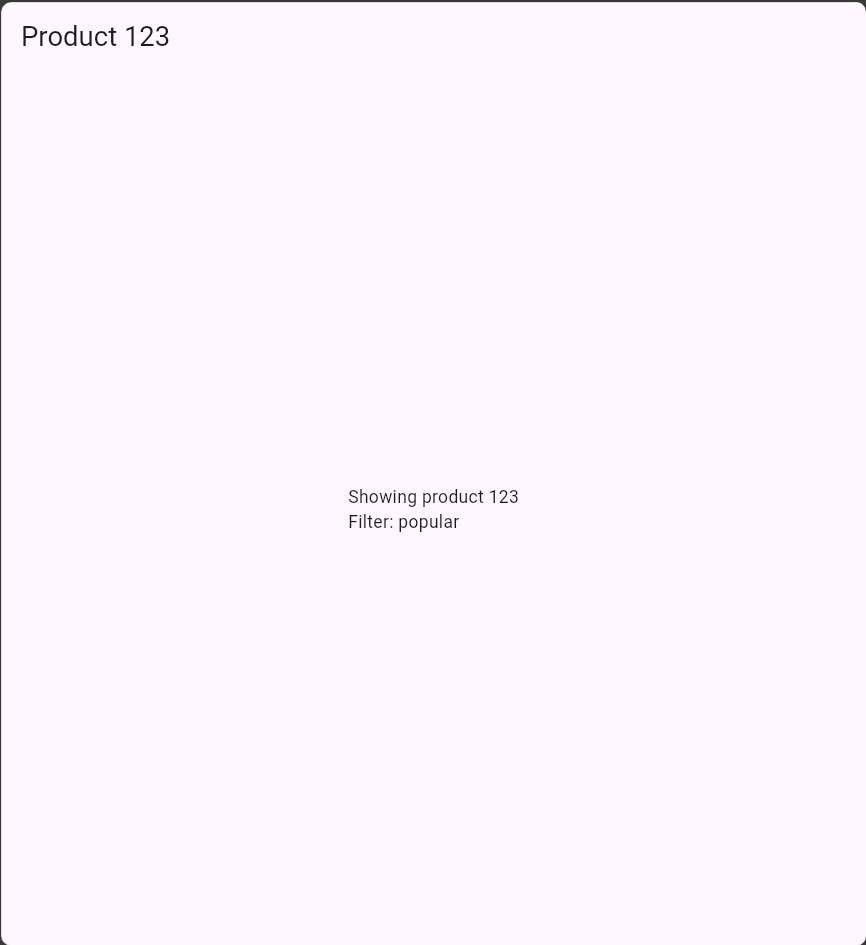

### Widget Tree
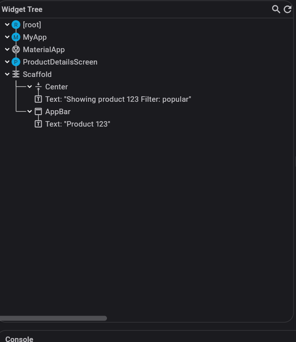

## Notes
All screenshots are stored in the `screenshots` folder.
